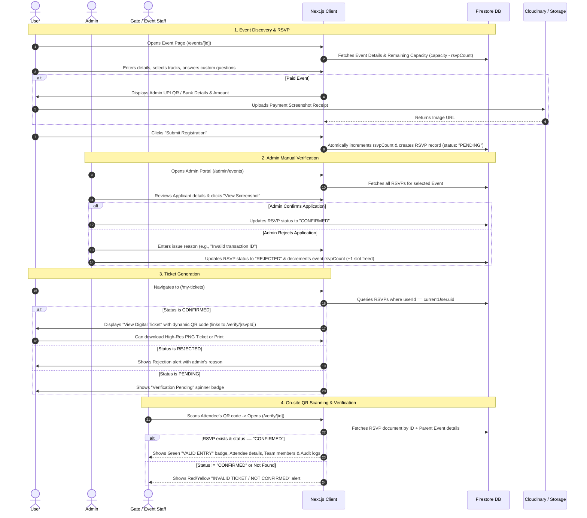

# Comprehensive Event Management, RSVP, Ticket Generation & QR Verification System

This document provides the complete architecture, data models, end-to-end production code, and implementation prompts for the Event Management and Ticketing System built for Next.js and Firebase Firestore.

---

## 1. System Architecture & Flow



---

## 2. Firestore Data Models

### `events/{eventId}` Collection
```json
{
  "id": "event_123",
  "title": "Kaizen Hackathon 2026",
  "description": "24-hour national hackathon...",
  "type": "hackathon",
  "date": "2026-10-15",
  "time": "09:00 AM",
  "location": "Main Auditorium & Lab 4",
  "posterUrl": "https://res.cloudinary.com/.../poster.png",
  "capacity": 150,
  "rsvpCount": 42,
  "isFree": false,
  "ticketPrice": 200,
  "individualFee": 200,
  "teamFee": 600,
  "paymentUpi": "club@upi",
  "paymentQrUrl": "https://res.cloudinary.com/.../upi_qr.png",
  "eventOptions": ["AI/ML Track", "Web3 Track", "Open Innovation"],
  "askCustomQuestion": true,
  "customQuestion": "What is your team's project idea summary?",
  "createdAt": "2026-09-01T10:00:00.000Z"
}
```

### `rsvps/{rsvpId}` Collection
```json
{
  "id": "rsvp_abc789",
  "eventId": "event_123",
  "eventTitle": "Kaizen Hackathon 2026",
  "userId": "firebase_auth_uid_xyz",
  "status": "CONFIRMED",
  "type": "team",
  "teamName": "CyberKnights",
  "leader": {
    "name": "Alex Smith",
    "email": "alex@example.com",
    "phone": "+919876543210",
    "collegeId": "CS-2024-042",
    "year": "3rd Year",
    "branch": "CSE"
  },
  "members": [
    { "name": "Sarah Connor", "email": "sarah@example.com", "collegeId": "CS-2024-088" },
    { "name": "John Doe", "email": "john@example.com", "collegeId": "CS-2024-102" }
  ],
  "selectedOptions": ["AI/ML Track"],
  "customAnswer": "Building an autonomous edge-AI pest detection drone system.",
  "paymentScreenshot": "https://res.cloudinary.com/.../payment_receipt.jpg",
  "issueReason": null,
  "createdAt": "2026-09-18T14:32:00.000Z"
}
```

---

## 3. Production Code Implementations

### Part A: Event Details & RSVP Modal (`src/app/(public)/events/[id]/page.jsx`)
Features:
- Live remaining slots counter (`capacity - rsvpCount`).
- Atomic capacity reservation (`increment(1)`).
- UPI QR code modal display with payment screenshot upload.
- Team (Leader + Members) or Individual registration.
- Custom question response handling.

```jsx
"use client";

import { useEffect, useState, use } from "react";
import { doc, getDoc, collection, addDoc, updateDoc, increment, query, where, getDocs } from "firebase/firestore";
import { db } from "@/lib/firebase";
import { useAuth } from "@/context/AuthContext";
import { motion, AnimatePresence } from "framer-motion";
import { 
  Calendar, Clock, MapPin, Users, Ticket, ArrowLeft, 
  CheckCircle, Loader2, Upload, AlertCircle, Sparkles, X, Plus, Trash2
} from "lucide-react";
import Link from "next/link";
import { toast } from "sonner";

export default function EventDetailPage({ params }) {
  const { id: eventId } = use(params);
  const { currentUser } = useAuth();
  
  const [event, setEvent] = useState(null);
  const [loading, setLoading] = useState(true);
  const [modalOpen, setModalOpen] = useState(false);
  const [step, setStep] = useState(1);
  const [applying, setApplying] = useState(false);
  const [uploadingImage, setUploadingImage] = useState(false);
  const [existingRsvp, setExistingRsvp] = useState(null);

  // Form State
  const [rsvpType, setRsvpType] = useState("Individual");
  const [teamName, setTeamName] = useState("");
  const [formData, setFormData] = useState({ name: "", email: "", phone: "", collegeId: "", year: "1st Year", branch: "CSE" });
  const [members, setMembers] = useState([]);
  const [selectedOptions, setSelectedOptions] = useState([]);
  const [customAnswer, setCustomAnswer] = useState("");
  const [proofUrl, setProofUrl] = useState("");

  useEffect(() => {
    async function loadData() {
      try {
        const docRef = doc(db, "events", eventId);
        const snap = await getDoc(docRef);
        if (!snap.exists()) return setLoading(false);
        const evtData = { id: snap.id, ...snap.data() };
        setEvent(evtData);

        if (currentUser) {
          const q = query(collection(db, "rsvps"), where("eventId", "==", eventId), where("userId", "==", currentUser.uid));
          const rsvpSnap = await getDocs(q);
          if (!rsvpSnap.empty) setExistingRsvp({ id: rsvpSnap.docs[0].id, ...rsvpSnap.docs[0].data() });
        }
      } catch (err) {
        console.error(err);
      } finally {
        setLoading(false);
      }
    }
    loadData();
  }, [eventId, currentUser]);

  // Upload Payment Screenshot to Cloudinary
  const handleUploadScreenshot = async (e) => {
    const file = e.target.files[0];
    if (!file) return;
    setUploadingImage(true);
    try {
      const data = new FormData();
      data.append("file", file);
      data.append("upload_preset", process.env.NEXT_PUBLIC_CLOUDINARY_UPLOAD_PRESET || "default_preset");
      const res = await fetch(`https://api.cloudinary.com/v1_1/${process.env.NEXT_PUBLIC_CLOUDINARY_CLOUD_NAME}/image/upload`, {
        method: "POST",
        body: data,
      });
      const json = await res.json();
      if (json.secure_url) {
        setProofUrl(json.secure_url);
        toast.success("Payment screenshot uploaded!");
      }
    } catch {
      toast.error("Failed to upload screenshot.");
    } finally {
      setUploadingImage(false);
    }
  };

  const handleApply = async () => {
    if (!event) return;
    setApplying(true);
    try {
      const eventRef = doc(db, "events", eventId);
      
      // Reserve slot
      await updateDoc(eventRef, { rsvpCount: increment(1) });

      const payload = {
        eventId,
        eventTitle: event.title,
        userId: currentUser?.uid || null,
        status: "PENDING",
        paymentScreenshot: proofUrl || null,
        createdAt: new Date().toISOString(),
        type: rsvpType.toLowerCase(),
        selectedOptions,
        customAnswer: customAnswer || null,
      };

      if (rsvpType === "Team") {
        payload.teamName = teamName;
        payload.leader = formData;
        payload.members = members;
      } else {
        Object.assign(payload, formData);
      }

      await addDoc(collection(db, "rsvps"), payload);
      setEvent(prev => ({ ...prev, rsvpCount: (prev.rsvpCount || 0) + 1 }));
      setStep(3); // Success Screen
    } catch (e) {
      toast.error("Registration failed: " + e.message);
    } finally {
      setApplying(false);
    }
  };

  if (loading) return <div className="min-h-screen flex items-center justify-center"><Loader2 className="w-8 h-8 animate-spin text-deep-teal" /></div>;
  if (!event) return <div className="min-h-screen flex items-center justify-center font-bold">Event not found.</div>;

  const spotsLeft = event.capacity ? Math.max(0, event.capacity - (event.rsvpCount || 0)) : null;
  const isFull = event.capacity && spotsLeft === 0;
  const currentFee = rsvpType === "Team" ? (event.teamFee || 0) : (event.individualFee || event.ticketPrice || 0);

  return (
    <div className="min-h-screen pt-28 pb-20 px-6 max-w-4xl mx-auto">
      <Link href="/events" className="inline-flex items-center gap-2 text-foreground/60 hover:text-deep-teal mb-6 font-semibold">
        <ArrowLeft className="w-4 h-4" /> Back to Events
      </Link>

      <div className="bg-card border border-border rounded-3xl p-6 md:p-10 shadow-xl">
        {event.posterUrl && (
          
        )}

        <div className="flex justify-between items-center mb-4">
          <span className="px-3 py-1 bg-deep-teal/10 text-deep-teal font-bold uppercase rounded-full text-xs">
            {event.type}
          </span>
          <span className="text-xs font-mono font-bold bg-foreground/5 px-3 py-1 rounded-md border border-border">
            {spotsLeft !== null ? `${spotsLeft} spots left` : "Unlimited Capacity"}
          </span>
        </div>

        <h1 className="font-heading text-2xl md:text-4xl font-bold mb-4">{event.title}</h1>
        <p className="text-foreground/70 mb-8 leading-relaxed">{event.description}</p>

        <div className="grid grid-cols-1 md:grid-cols-3 gap-4 mb-8 p-4 bg-background/50 rounded-2xl border border-border">
          <div className="flex items-center gap-3"><Calendar className="text-deep-teal w-5 h-5"/><div><p className="text-xs text-foreground/50 uppercase font-bold">Date</p><p className="font-medium">{event.date}</p></div></div>
          <div className="flex items-center gap-3"><Clock className="text-deep-teal w-5 h-5"/><div><p className="text-xs text-foreground/50 uppercase font-bold">Time</p><p className="font-medium">{event.time}</p></div></div>
          <div className="flex items-center gap-3"><MapPin className="text-deep-teal w-5 h-5"/><div><p className="text-xs text-foreground/50 uppercase font-bold">Venue</p><p className="font-medium">{event.location}</p></div></div>
        </div>

        {existingRsvp ? (
          <div className="p-4 bg-green-500/10 border border-green-500/20 rounded-xl flex items-center justify-between">
            <span className="font-bold text-green-500 flex items-center gap-2"><CheckCircle className="w-5 h-5"/> You have registered!</span>
            <Link href="/my-tickets" className="text-sm font-bold text-deep-teal underline">View My Ticket →</Link>
          </div>
        ) : isFull ? (
          <button disabled className="w-full py-4 bg-foreground/10 text-foreground/40 font-bold rounded-xl cursor-not-allowed">Event Full</button>
        ) : (
          <button onClick={() => { setStep(1); setModalOpen(true); }} className="w-full py-4 bg-deep-teal text-white font-bold rounded-xl hover:bg-muted-teal transition-all shadow-lg shadow-deep-teal/20">
            Register Now
          </button>
        )}
      </div>

      {/* Registration Modal */}
      <AnimatePresence>
        {modalOpen && (
          <div className="fixed inset-0 z-50 bg-background/80 backdrop-blur-sm flex items-center justify-center p-4">
            <motion.div initial={{ scale: 0.95, opacity: 0 }} animate={{ scale: 1, opacity: 1 }} exit={{ scale: 0.95, opacity: 0 }}
              className="bg-card border border-border rounded-3xl p-6 md:p-8 max-w-xl w-full max-h-[90vh] overflow-y-auto relative shadow-2xl">
              <button onClick={() => setModalOpen(false)} className="absolute top-6 right-6 text-foreground/40 hover:text-foreground"><X className="w-5 h-5"/></button>

              {step === 1 && (
                <div className="space-y-4">
                  <h2 className="text-xl font-bold font-heading">Attendee Details</h2>
                  <div className="flex gap-2 p-1 bg-background rounded-xl border border-border">
                    {["Individual", "Team"].map(t => (
                      <button key={t} onClick={() => setRsvpType(t)} className={`flex-1 py-2 text-sm font-bold rounded-lg transition-all ${rsvpType === t ? "bg-deep-teal text-white" : "text-foreground/70"}`}>{t}</button>
                    ))}
                  </div>

                  {rsvpType === "Team" && (
                    <input placeholder="Team Name *" value={teamName} onChange={e => setTeamName(e.target.value)} className="w-full p-3 bg-background border border-border rounded-xl text-sm outline-none focus:border-deep-teal"/>
                  )}

                  <input placeholder="Full Name *" value={formData.name} onChange={e => setFormData({ ...formData, name: e.target.value })} className="w-full p-3 bg-background border border-border rounded-xl text-sm outline-none focus:border-deep-teal"/>
                  <input placeholder="Email Address *" type="email" value={formData.email} onChange={e => setFormData({ ...formData, email: e.target.value })} className="w-full p-3 bg-background border border-border rounded-xl text-sm outline-none focus:border-deep-teal"/>
                  <input placeholder="College ID / Roll No *" value={formData.collegeId} onChange={e => setFormData({ ...formData, collegeId: e.target.value })} className="w-full p-3 bg-background border border-border rounded-xl text-sm outline-none focus:border-deep-teal"/>

                  {event.askCustomQuestion && event.customQuestion && (
                    <div>
                      <label className="text-xs font-bold text-foreground/70 mb-1 block">{event.customQuestion} *</label>
                      <textarea rows={3} value={customAnswer} onChange={e => setCustomAnswer(e.target.value)} className="w-full p-3 bg-background border border-border rounded-xl text-sm outline-none focus:border-deep-teal"/>
                    </div>
                  )}

                  <button onClick={() => setStep(event.isFree ? 3 : 2)} className="w-full py-3 bg-deep-teal text-white font-bold rounded-xl mt-4">
                    {event.isFree ? "Complete Registration" : `Proceed to Payment (₹${currentFee})`}
                  </button>
                </div>
              )}

              {step === 2 && (
                <div className="space-y-4 text-center">
                  <h2 className="text-xl font-bold font-heading">Scan & Pay via UPI</h2>
                  <p className="text-xs text-foreground/60">Amount to Pay: <span className="font-bold text-deep-teal text-sm">₹{currentFee}</span></p>

                  {event.paymentQrUrl ? (
                    
                  ) : (
                    <div className="p-4 bg-background border border-border rounded-xl text-sm font-mono">{event.paymentUpi || "admin@upi"}</div>
                  )}

                  <div className="text-left pt-2">
                    <label className="text-xs font-bold text-foreground/70 mb-1 block">Upload Payment Screenshot *</label>
                    <input type="file" accept="image/*" onChange={handleUploadScreenshot} className="w-full text-xs text-foreground/60 file:mr-3 file:py-2 file:px-4 file:rounded-xl file:border-0 file:text-xs file:font-bold file:bg-deep-teal file:text-white cursor-pointer"/>
                    {uploadingImage && <p className="text-xs text-deep-teal mt-1 animate-pulse">Uploading screenshot...</p>}
                    {proofUrl && <p className="text-xs text-green-500 mt-1 font-bold">✓ Screenshot uploaded successfully</p>}
                  </div>

                  <div className="flex gap-3 pt-4">
                    <button onClick={() => setStep(1)} className="flex-1 py-3 border border-border font-bold rounded-xl text-sm">Back</button>
                    <button onClick={handleApply} disabled={applying || (!event.isFree && !proofUrl)} className="flex-1 py-3 bg-deep-teal text-white font-bold rounded-xl text-sm disabled:opacity-50">
                      {applying ? "Submitting..." : "Submit RSVP"}
                    </button>
                  </div>
                </div>
              )}

              {step === 3 && (
                <div className="text-center py-6 space-y-4">
                  <CheckCircle className="w-16 h-16 text-green-500 mx-auto animate-bounce" />
                  <h2 className="text-2xl font-bold font-heading">Application Submitted!</h2>
                  <p className="text-sm text-foreground/70">Your application has been received. Once the admin verifies your payment screenshot, your digital ticket pass will be generated.</p>
                  <Link href="/my-tickets" className="block w-full py-3 bg-deep-teal text-white font-bold rounded-xl">View My Tickets</Link>
                </div>
              )}
            </motion.div>
          </div>
        )}
      </AnimatePresence>
    </div>
  );
}
```

---

### Part B: Admin Manual Verification Dashboard (`src/app/admin/events/page.js`)
Features:
- Filter by Year, Type (Team/Individual), and Status (All / Confirmed / Pending / Rejected).
- Review screenshot modal & 1-click Confirm or Reject with reason.
- Auto-restoration of slot capacity upon rejection (`increment(-1)`).
- Guaranteed horizontal scroll styling with `.custom-scrollbar` and min-width columns.

```jsx
"use client";

import { useEffect, useState } from "react";
import { collection, getDocs, doc, updateDoc, increment } from "firebase/firestore";
import { db } from "@/lib/firebase";
import { motion, AnimatePresence } from "framer-motion";
import { CheckCircle, XCircle, ExternalLink, QrCode, Filter, Download, X } from "lucide-react";
import { toast } from "sonner";

export default function AdminEventsDashboard() {
  const [rsvps, setRsvps] = useState([]);
  const [loading, setLoading] = useState(true);
  const [filterStatus, setFilterStatus] = useState("All");
  const [reviewModal, setReviewModal] = useState(null);
  const [issueReason, setIssueReason] = useState("");

  const fetchRsvps = async () => {
    try {
      const snap = await getDocs(collection(db, "rsvps"));
      setRsvps(snap.docs.map(d => ({ id: d.id, ...d.data() })));
    } catch {
      toast.error("Failed to load registrations.");
    } finally {
      setLoading(false);
    }
  };

  useEffect(() => { fetchRsvps(); }, []);

  const handleConfirm = async (rsvp) => {
    try {
      await updateDoc(doc(db, "rsvps", rsvp.id), { status: "CONFIRMED", issueReason: null });
      setRsvps(prev => prev.map(r => r.id === rsvp.id ? { ...r, status: "CONFIRMED" } : r));
      toast.success("Ticket Confirmed & Digital Pass Issued!");
      setReviewModal(null);
    } catch {
      toast.error("Failed to confirm RSVP.");
    }
  };

  const handleReject = async (rsvp) => {
    try {
      await updateDoc(doc(db, "rsvps", rsvp.id), { status: "REJECTED", issueReason });
      // Free up slot for someone else
      if (rsvp.eventId) {
        await updateDoc(doc(db, "events", rsvp.eventId), { rsvpCount: increment(-1) });
      }
      setRsvps(prev => prev.map(r => r.id === rsvp.id ? { ...r, status: "REJECTED", issueReason } : r));
      toast.success("Application marked rejected. Slot freed.");
      setReviewModal(null);
    } catch {
      toast.error("Failed to reject RSVP.");
    }
  };

  const filtered = rsvps.filter(r => filterStatus === "All" || r.status === filterStatus);

  return (
    <div className="space-y-6">
      <div className="flex justify-between items-center bg-card p-6 rounded-2xl border border-border">
        <div>
          <h1 className="text-2xl font-bold font-heading">RSVP Applications & Ticketing</h1>
          <p className="text-sm text-foreground/60">Review attendee payments and generate valid QR passes.</p>
        </div>
        <select value={filterStatus} onChange={e => setFilterStatus(e.target.value)} className="p-2 bg-background border border-border rounded-xl text-sm font-semibold">
          <option value="All">All Statuses</option>
          <option value="PENDING">Pending Verification</option>
          <option value="CONFIRMED">Confirmed</option>
          <option value="REJECTED">Rejected</option>
        </select>
      </div>

      <div className="bg-card border border-border rounded-2xl overflow-hidden shadow-sm">
        <div className="w-full overflow-x-auto custom-scrollbar pb-2">
          <table className="w-full min-w-[1100px] text-left border-collapse">
            <thead>
              <tr className="bg-background border-b border-border text-xs uppercase font-bold text-foreground/70">
                <th className="px-5 py-3.5 min-w-[200px]">Applicant</th>
                <th className="px-5 py-3.5 min-w-[140px]">Type</th>
                <th className="px-5 py-3.5 min-w-[140px]">Details</th>
                <th className="px-5 py-3.5 min-w-[250px]">Custom Answer</th>
                <th className="px-5 py-3.5 min-w-[160px]">Payment Proof</th>
                <th className="px-5 py-3.5 min-w-[120px]">Status</th>
                <th className="px-5 py-3.5 min-w-[180px] text-right">Actions</th>
              </tr>
            </thead>
            <tbody className="divide-y divide-border text-sm">
              {filtered.map(rsvp => (
                <tr key={rsvp.id} className="hover:bg-background/40">
                  <td className="px-5 py-3.5 font-bold">
                    {rsvp.type === "team" ? rsvp.teamName : rsvp.name}
                    <span className="block text-xs font-normal text-foreground/60">{rsvp.type === "team" ? rsvp.leader?.email : rsvp.email}</span>
                  </td>
                  <td className="px-5 py-3.5 uppercase font-mono text-xs">{rsvp.type}</td>
                  <td className="px-5 py-3.5 text-xs text-foreground/70">
                    {rsvp.year} • {rsvp.branch} • {rsvp.collegeId}
                  </td>
                  <td className="px-5 py-3.5 text-xs text-foreground/80 break-words">{rsvp.customAnswer || "-"}</td>
                  <td className="px-5 py-3.5">
                    {rsvp.paymentScreenshot ? (
                      <a href={rsvp.paymentScreenshot} target="_blank" rel="noreferrer" className="text-xs font-bold text-deep-teal hover:underline flex items-center gap-1">
                        <ExternalLink className="w-3 h-3" /> View Receipt
                      </a>
                    ) : <span className="text-xs text-foreground/40">Free / No proof</span>}
                  </td>
                  <td className="px-5 py-3.5">
                    <span className={`px-2 py-0.5 rounded-full text-[10px] font-bold uppercase ${
                      rsvp.status === "CONFIRMED" ? "bg-green-500/10 text-green-500" :
                      rsvp.status === "REJECTED" ? "bg-red-500/10 text-red-500" : "bg-yellow-500/10 text-yellow-500"
                    }`}>
                      {rsvp.status}
                    </span>
                  </td>
                  <td className="px-5 py-3.5 text-right">
                    <button onClick={() => { setReviewModal(rsvp); setIssueReason(rsvp.issueReason || ""); }}
                      className="px-3 py-1.5 bg-deep-teal/10 text-deep-teal border border-deep-teal/20 rounded-lg text-xs font-bold hover:bg-deep-teal hover:text-white transition-all">
                      Review / Edit
                    </button>
                  </td>
                </tr>
              ))}
            </tbody>
          </table>
        </div>
      </div>

      {/* Review Modal */}
      <AnimatePresence>
        {reviewModal && (
          <div className="fixed inset-0 z-50 bg-background/80 backdrop-blur-sm flex items-center justify-center p-4">
            <motion.div initial={{ scale: 0.95 }} animate={{ scale: 1 }} exit={{ scale: 0.95 }}
              className="bg-card border border-border rounded-3xl p-6 max-w-md w-full relative shadow-2xl">
              <button onClick={() => setReviewModal(null)} className="absolute top-4 right-4"><X className="w-5 h-5"/></button>
              <h2 className="text-lg font-bold mb-4 font-heading">Verify Application</h2>
              <p className="text-sm mb-2"><span className="text-foreground/50">Applicant:</span> <span className="font-bold">{reviewModal.name || reviewModal.teamName}</span></p>
              
              {reviewModal.paymentScreenshot && (
                <div className="my-4">
                  <p className="text-xs font-bold text-foreground/60 uppercase mb-1">Receipt Screenshot:</p>
                  
                </div>
              )}

              <div className="mb-4">
                <label className="text-xs font-bold text-foreground/60 uppercase mb-1 block">Rejection Reason (if applicable):</label>
                <input placeholder="e.g. Invalid transaction ID" value={issueReason} onChange={e => setIssueReason(e.target.value)} className="w-full p-2.5 bg-background border border-border rounded-xl text-xs outline-none"/>
              </div>

              <div className="flex gap-3">
                <button onClick={() => handleReject(reviewModal)} className="flex-1 py-2.5 bg-red-500/10 text-red-500 font-bold text-xs rounded-xl border border-red-500/20 hover:bg-red-500 hover:text-white">Reject & Free Slot</button>
                <button onClick={() => handleConfirm(reviewModal)} className="flex-1 py-2.5 bg-green-500 text-white font-bold text-xs rounded-xl hover:bg-green-600">Confirm & Issue Ticket</button>
              </div>
            </motion.div>
          </div>
        )}
      </AnimatePresence>
    </div>
  );
}
```

---

### Part C: Attendee Digital Pass with QR Code (`src/app/(public)/my-tickets/page.jsx`)
Features:
- Live QR Code generated via `qrcode.react` encoding `${origin}/verify/${ticket.id}`.
- Perforated ticket stub aesthetic with dark/light mode logos.
- 1-click Download Ticket as high-resolution PNG using `html-to-image`.

```jsx
"use client";

import { useEffect, useState, useRef } from "react";
import { collection, query, where, getDocs, doc, getDoc } from "firebase/firestore";
import { db } from "@/lib/firebase";
import { useAuth } from "@/context/AuthContext";
import { QRCodeCanvas } from "qrcode.react";
import * as htmlToImage from "html-to-image";
import { motion, AnimatePresence } from "framer-motion";
import { Ticket, QrCode, Download, CheckCircle, Loader2 } from "lucide-react";
import { toast } from "sonner";

export default function MyTicketsPage() {
  const { currentUser } = useAuth();
  const [tickets, setTickets] = useState([]);
  const [loading, setLoading] = useState(true);
  const [selectedTicket, setSelectedTicket] = useState(null);
  const ticketRef = useRef(null);

  useEffect(() => {
    if (!currentUser) return setLoading(false);
    async function fetchTickets() {
      const q = query(collection(db, "rsvps"), where("userId", "==", currentUser.uid));
      const snap = await getDocs(q);
      const list = snap.docs.map(d => ({ id: d.id, ...d.data() }));
      setTickets(list);
      setLoading(false);
    }
    fetchTickets();
  }, [currentUser]);

  const handleDownload = async () => {
    if (!ticketRef.current) return;
    try {
      const dataUrl = await htmlToImage.toPng(ticketRef.current, { pixelRatio: 3 });
      const link = document.createElement("a");
      link.href = dataUrl;
      link.download = `Event_Ticket_${selectedTicket.id}.png`;
      link.click();
      toast.success("Ticket saved to device!");
    } catch {
      toast.error("Failed to download image.");
    }
  };

  if (loading) return <div className="min-h-screen flex items-center justify-center"><Loader2 className="w-8 h-8 animate-spin text-deep-teal"/></div>;

  return (
    <div className="min-h-screen pt-28 pb-20 px-6 max-w-5xl mx-auto">
      <h1 className="text-3xl font-bold font-heading mb-8">My Digital Tickets</h1>
      
      <div className="grid grid-cols-1 md:grid-cols-2 lg:grid-cols-3 gap-6">
        {tickets.map(ticket => (
          <div key={ticket.id} className="bg-card border border-border rounded-2xl p-6 flex flex-col justify-between shadow-sm">
            <div>
              <span className={`px-2 py-0.5 rounded text-[10px] font-bold uppercase ${ticket.status === "CONFIRMED" ? "bg-green-500/10 text-green-500" : "bg-yellow-500/10 text-yellow-500"}`}>
                {ticket.status}
              </span>
              <h3 className="font-bold text-lg mt-3">{ticket.eventTitle}</h3>
              <p className="text-xs text-foreground/60 mt-1">Attendee: {ticket.name || ticket.teamName}</p>
            </div>

            {ticket.status === "CONFIRMED" ? (
              <button onClick={() => setSelectedTicket(ticket)} className="mt-6 w-full py-2.5 bg-deep-teal text-white font-bold text-xs rounded-xl flex items-center justify-center gap-2 hover:bg-muted-teal">
                <QrCode className="w-4 h-4"/> View Digital Pass
              </button>
            ) : (
              <p className="text-xs text-foreground/40 mt-6 italic">Awaiting Admin Confirmation</p>
            )}
          </div>
        ))}
      </div>

      {/* Ticket Pass Modal */}
      <AnimatePresence>
        {selectedTicket && (
          <div className="fixed inset-0 z-50 bg-background/90 backdrop-blur-md flex items-center justify-center p-4" onClick={() => setSelectedTicket(null)}>
            <div onClick={e => e.stopPropagation()} className="flex flex-col items-center">
              <div ref={ticketRef} className="bg-card border border-border rounded-[2rem] p-6 max-w-sm w-full shadow-2xl text-center relative overflow-hidden">
                <div className="inline-flex items-center gap-1 px-3 py-1 bg-green-500/10 text-green-500 rounded-full text-[10px] font-bold uppercase mb-4">
                  <CheckCircle className="w-3 h-3"/> Verified Entry Pass
                </div>

                <h2 className="font-heading text-xl font-bold text-foreground mb-1">{selectedTicket.eventTitle}</h2>
                <p className="text-xs font-semibold text-deep-teal mb-6">{selectedTicket.teamName || selectedTicket.name}</p>

                <div className="bg-white p-4 rounded-2xl inline-block border-2 border-dashed border-gray-300 mb-4 shadow-inner">
                  <QRCodeCanvas value={`${typeof window !== "undefined" ? window.location.origin : ""}/verify/${selectedTicket.id}`} size={140} level="H"/>
                </div>

                <p className="font-mono text-[10px] text-foreground/50 tracking-widest uppercase">Scan at entry gate</p>
                <p className="font-mono text-xs font-bold mt-1 text-foreground/80">ID: {selectedTicket.id.slice(0, 10).toUpperCase()}</p>
              </div>

              <div className="flex gap-3 mt-6">
                <button onClick={handleDownload} className="px-6 py-3 bg-deep-teal text-white font-bold rounded-xl flex items-center gap-2 shadow-lg hover:bg-muted-teal">
                  <Download className="w-4 h-4"/> Download PNG
                </button>
                <button onClick={() => setSelectedTicket(null)} className="px-6 py-3 bg-card border border-border font-bold rounded-xl">Close</button>
              </div>
            </div>
          </div>
        )}
      </AnimatePresence>
    </div>
  );
}
```

---

### Part D: Gate QR Verification Scanner Page (`src/app/(public)/verify/[id]/page.jsx`)
Features:
- Live scan lookup: checks document ID from `/verify/[id]`.
- Instant Security Check: Green **VALID ENTRY** or Red **INVALID / NOT CONFIRMED**.
- Displays attendee identity, team members, registration timestamp, and parent event info.

```jsx
"use client";

import { useEffect, useState, use } from "react";
import { doc, getDoc } from "firebase/firestore";
import { db } from "@/lib/firebase";
import { motion } from "framer-motion";
import { CheckCircle, XCircle, Loader2, Calendar, Clock, MapPin, User, ShieldCheck } from "lucide-react";
import Link from "next/link";

export default function TicketVerifyPage({ params }) {
  const { id } = use(params);
  const [ticket, setTicket] = useState(null);
  const [eventDetails, setEventDetails] = useState(null);
  const [loading, setLoading] = useState(true);
  const [error, setError] = useState("");

  useEffect(() => {
    async function verify() {
      try {
        const snap = await getDoc(doc(db, "rsvps", id));
        if (!snap.exists()) {
          setError("Ticket does not exist in registry.");
          return setLoading(false);
        }
        const data = { id: snap.id, ...snap.data() };
        setTicket(data);

        if (data.eventId) {
          const evtSnap = await getDoc(doc(db, "events", data.eventId));
          if (evtSnap.exists()) setEventDetails(evtSnap.data());
        }
      } catch (e) {
        setError("Network error while verifying ticket.");
      } finally {
        setLoading(false);
      }
    }
    verify();
  }, [id]);

  if (loading) return <div className="min-h-screen flex items-center justify-center font-bold"><Loader2 className="w-8 h-8 animate-spin text-deep-teal"/></div>;
  if (error || !ticket) return (
    <div className="min-h-screen flex flex-col items-center justify-center p-6 text-center">
      <XCircle className="w-16 h-16 text-red-500 mb-4"/>
      <h1 className="text-2xl font-bold text-red-500 font-heading">Invalid Ticket</h1>
      <p className="text-foreground/70 mb-6">{error}</p>
      <Link href="/" className="px-6 py-2 bg-card border border-border rounded-xl font-bold">Return Home</Link>
    </div>
  );

  const isValid = ticket.status === "CONFIRMED";

  return (
    <div className="min-h-screen pt-24 pb-20 px-6 flex justify-center items-center bg-background">
      <motion.div initial={{ scale: 0.95, opacity: 0 }} animate={{ scale: 1, opacity: 1 }}
        className="max-w-md w-full bg-card border border-border rounded-[2.5rem] shadow-2xl overflow-hidden">
        
        {/* Top Header Banner */}
        <div className={`p-8 text-center text-white ${isValid ? "bg-green-500" : "bg-red-500"}`}>
          {isValid ? (
            <>
              <CheckCircle className="w-16 h-16 mx-auto mb-2 text-white drop-shadow"/>
              <h1 className="text-3xl font-bold font-heading tracking-tight">VALID ENTRY</h1>
              <p className="text-sm font-medium opacity-90">Ticket Verified & Confirmed</p>
            </>
          ) : (
            <>
              <XCircle className="w-16 h-16 mx-auto mb-2 text-white drop-shadow"/>
              <h1 className="text-2xl font-bold font-heading">NOT CONFIRMED</h1>
              <p className="text-sm font-medium opacity-90">Status: {ticket.status}</p>
            </>
          )}
        </div>

        <div className="p-6 space-y-6">
          <div className="flex items-center gap-4 pb-4 border-b border-border">
            <div className="w-12 h-12 rounded-full bg-deep-teal/10 flex items-center justify-center font-bold text-deep-teal">
              <User className="w-6 h-6"/>
            </div>
            <div>
              <p className="text-xs uppercase font-bold text-foreground/50">{ticket.type === "team" ? "Team Leader" : "Attendee"}</p>
              <h2 className="text-lg font-bold">{ticket.name || ticket.leader?.name || ticket.teamName}</h2>
            </div>
          </div>

          <div>
            <p className="text-xs uppercase font-bold text-foreground/50 mb-1">Event</p>
            <h3 className="text-xl font-bold text-deep-teal font-heading">{ticket.eventTitle}</h3>
            {eventDetails && (
              <p className="text-xs text-foreground/60 mt-1">{eventDetails.date} • {eventDetails.time} • {eventDetails.location}</p>
            )}
          </div>

          <div className="p-4 bg-background/60 rounded-xl border border-border text-xs space-y-1">
            <p><span className="text-foreground/50 font-bold">Ticket ID:</span> <span className="font-mono">{ticket.id}</span></p>
            <p><span className="text-foreground/50 font-bold">Registered:</span> {new Date(ticket.createdAt).toLocaleString()}</p>
            <p><span className="text-foreground/50 font-bold">Type:</span> <span className="uppercase font-mono">{ticket.type}</span></p>
          </div>
        </div>
      </motion.div>
    </div>
  );
}
```

---

## 4. Complete Implementation Prompt

Use the prompt below to recreate or scaffold this complete system in any project:

```text
Implement a complete, production-ready Event Management, RSVP, Manual Payment Verification, and Digital QR Ticketing system in Next.js (App Router) + Firebase Firestore with Tailwind CSS:

1. Data Architecture:
   - "events" collection: title, description, posterUrl, capacity, rsvpCount, isFree, individualFee, teamFee, paymentUpi, paymentQrUrl, eventOptions, askCustomQuestion, customQuestion.
   - "rsvps" collection: eventId, eventTitle, userId, status ("PENDING" | "CONFIRMED" | "REJECTED"), type ("individual" | "team"), leader/attendee details, members array, customAnswer, paymentScreenshot URL, issueReason, createdAt.

2. Public Event Registration (/events/[id]):
   - Displays real-time spots remaining (capacity - rsvpCount).
   - Multi-step modal for Individual / Team registration + custom questions.
   - For paid events: displays UPI QR code & UPI ID with Cloudinary/Firebase screenshot upload.
   - Atomically increments event rsvpCount and saves RSVP with "PENDING" status.

3. Admin Management Portal (/admin/events):
   - Table of all RSVPs with custom-scrollbar and responsive column widths.
   - Quick filters by Status, Type, and Year.
   - Review modal to inspect payment receipts.
   - 1-click Confirm (issues valid ticket) or Reject (with issue reason & atomic slot decrement to free capacity).

4. User Ticket Pass (/my-tickets):
   - Displays user registrations.
   - For CONFIRMED registrations: renders a digital ticket stub with dynamic QR code (pointing to /verify/[rsvpId]) using 'qrcode.react'.
   - 1-click high-res PNG download using 'html-to-image'.

5. QR Verification Scanner (/verify/[id]):
   - Direct gate scanner page that reads Firestore document by RSVP ID.
   - Shows Green "VALID ENTRY" badge for CONFIRMED tickets with attendee and event details, or Red "INVALID TICKET" alert if pending/rejected/not found.
```
